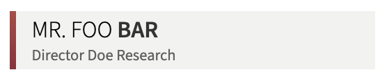

LowerThird
==========

**Lower Thirds for OBS Studio**

Abstract
--------

**LowerThird** is a plain HTML/CSS/JS Browser Source layer for
[OBS Studio](http://obsproject.com/) for displaying one or more
[lower thirds](https://en.wikipedia.org/wiki/Lower_third) as an animated overlay in a
video broadcasting scene. This is usually used to annotate persons with
their name and role.

**LowerThird** is a very slim alternative to the awesome and a lot more sophisticated
[Animated Lower Thirds with Dockable Control Panel](https://obsproject.com/forum/resources/animated-lower-thirds-with-dockable-control-panel.1057/),
but **LowerThird** allows to explicitly specify the scene id from its Browser Source
which allows one to arbitrary jump between scenes and still have the correct
lower thirds being displayed. Additionally, **LowerThirds** can display an
arbitrary amount of lower thirds per scene (not just 4) and allows
an arbitrary number of scenes (not just 10).

Usage
-----

1. Install [Node.js](https://nodejs.org/) and [Git](https://git-scm.com/).

2. Clone the **LowerThird** sources: 
   `git clone --depth 1 https://github.com/rse/lowerthird` 
   `cd lowerthird` 

3. Download all dependencies: 
   `$ npm install`

4. Edit your lower thirds in the manifest: 
   `$ vi manifest.yaml`

5. Convert the manifest for loading into the Browser Source: 
   `$ npm run convert`

6. Test-Drive in regular Browser
   `$ open index.html?scene=`*id*

7. Finally, add your Browser Source to your scenes:

   - Local File: **(disabled)**
   - URL: *local-path*`/lowerthird/index.html?scene=`*id*
   - Width: **1280**
   - Height: **720**
   - Use custom frame rate: **(disabled)**
   - Control audio via OBS: **(disabled)**
   - Custom CSS: **(empty)**
   - Shutdown source when not visible: **(enabled)**
   - Refresh browser when scene becomes active: **(enabled)**

License
-------

Copyright (c) 2021 Dr. Ralf S. Engelschall (http://engelschall.com/)

Permission is hereby granted, free of charge, to any person obtaining
a copy of this software and associated documentation files (the
"Software"), to deal in the Software without restriction, including
without limitation the rights to use, copy, modify, merge, publish,
distribute, sublicense, and/or sell copies of the Software, and to
permit persons to whom the Software is furnished to do so, subject to
the following conditions:

The above copyright notice and this permission notice shall be included
in all copies or substantial portions of the Software.

THE SOFTWARE IS PROVIDED "AS IS", WITHOUT WARRANTY OF ANY KIND,
EXPRESS OR IMPLIED, INCLUDING BUT NOT LIMITED TO THE WARRANTIES OF
MERCHANTABILITY, FITNESS FOR A PARTICULAR PURPOSE AND NONINFRINGEMENT.
IN NO EVENT SHALL THE AUTHORS OR COPYRIGHT HOLDERS BE LIABLE FOR ANY
CLAIM, DAMAGES OR OTHER LIABILITY, WHETHER IN AN ACTION OF CONTRACT,
TORT OR OTHERWISE, ARISING FROM, OUT OF OR IN CONNECTION WITH THE
SOFTWARE OR THE USE OR OTHER DEALINGS IN THE SOFTWARE.

